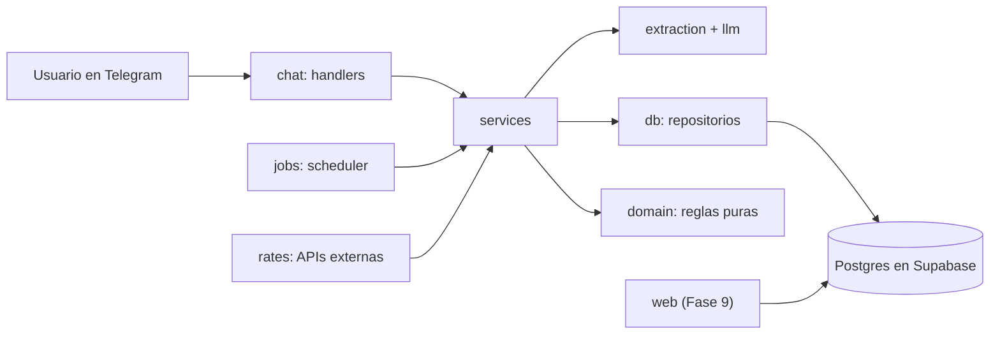

# gastos-multimoneda

Bot de Telegram que registra gastos e ingresos escritos en lenguaje natural en Bs, COP, USD y USDT.
Guarda cada movimiento en su moneda original con un snapshot de la tasa a USD.
Responde preguntas sobre tus finanzas, envía un resumen semanal y (Fase 9) ofrece una web para verlo todo.

## Arquitectura



Detalles en [docs/STACK_Y_ARQUITECTURA.md](docs/STACK_Y_ARQUITECTURA.md) y decisiones en [docs/decisions/](docs/decisions/).

## Desarrollo

Requisitos: Git, Docker, [uv](https://docs.astral.sh/uv/) y la [Supabase CLI](https://supabase.com/docs/guides/cli).

```bash
cp bot/.env.example bot/.env   # rellena los valores
make setup                     # dependencias del bot
make db-up                     # Supabase local (Docker)
make check                     # lint, tipos, capas, pruebas y pgTAP
pre-commit install             # ruff + gitleaks antes de cada commit
```

## Licencia

MIT
