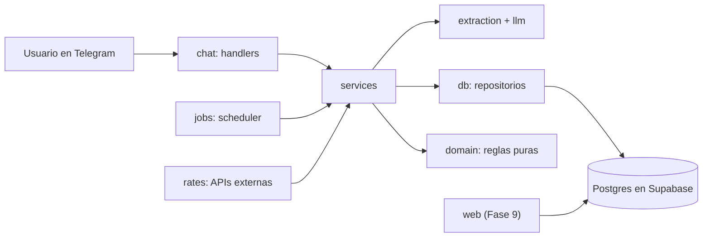

# Stack técnico y lineamientos del proyecto (Fase 0)

> Proyecto: asistente de gastos multimoneda (Bs, COP, USD y USDT) por Telegram, con una app web para ver todo centralizado.
> Este documento fija el stack, la estructura del repositorio y las reglas de arquitectura **antes** de escribir lógica. Su lugar en el repositorio es `docs/STACK_Y_ARQUITECTURA.md`.

Todo lo de aquí es una propuesta. Si cambias una decisión, déjala registrada como ADR en `docs/decisions/` con el motivo. Verifica las versiones y los límites de los planes gratuitos vigentes antes de comprometerte con ellos.

---

## 1. Stack elegido

| Capa | Elección | Por qué |
|---|---|---|
| Lenguaje del bot | Python 3.12+ | Es tu stack y tiene el mejor ecosistema para IA y datos |
| Entorno y dependencias | uv | Una sola herramienta para entorno, dependencias y lockfile |
| Telegram | aiogram 3 | Async nativo, routers y máquina de estados integrada para los flujos de aclaración ("¿en qué moneda?") |
| Servidor HTTP | FastAPI + uvicorn | Solo para el webhook de Telegram y `/health`; en desarrollo se usa polling |
| Validación y configuración | Pydantic v2 + pydantic-settings | El mismo modelo valida la salida del LLM y la configuración |
| LLM | Gemini Flash (principal) y Groq (alternativa), detrás de una interfaz propia | Cambiar de proveedor sin tocar el resto y esquivar límites del plan gratuito |
| Base de datos | Postgres en Supabase | Ya lo usas en Constancia; aporta Auth y RLS para la web |
| Acceso a datos | psycopg 3 (async, con pool) y SQL explícito | Transacciones reales (un cambio de moneda toca dos cuentas) y el SQL queda visible en el repositorio |
| Migraciones y pruebas de BD | Supabase CLI + pgTAP | Mismo flujo que ya conoces |
| Cliente HTTP | httpx | Async y fácil de simular en pruebas |
| Tareas programadas | APScheduler dentro del proceso del bot | Un solo servicio que desplegar; n8n sigue siendo opción si prefieres orquestación visual |
| Calidad | ruff, pyright, pytest + pytest-asyncio, import-linter | Estilo, tipos, pruebas y reglas de arquitectura automáticas |
| Web (Fase 9) | Next.js (App Router) + Tailwind + Recharts + `@supabase/ssr`, con pnpm | Mismas herramientas que Constancia |
| CI | GitHub Actions | Gratis para repositorios públicos |
| Despliegue | Bot en Railway, Render o Fly.io; web en Vercel | Planes gratuitos o baratos |

### Alternativas que descarté

- **python-telegram-bot:** es válida; elegí aiogram por su máquina de estados, útil para las aclaraciones de moneda.
- **SQLAlchemy:** añade una capa que no necesitas; con SQL explícito el proyecto muestra dominio de la base de datos.
- **supabase-py para el bot:** pasa por PostgREST, que no ofrece transacciones de varias tablas sin escribir RPC para todo.
- **WhatsApp:** exige verificación de negocio con Meta y puede tener costo por mensaje. Queda como expansión futura.
- **Turborepo o workspaces:** son dos proyectos en lenguajes distintos; no hace falta herramienta de monorepo.

---

## 2. Estructura del repositorio

Un solo repositorio con dos proyectos (bot en Python, web en TypeScript). `supabase/` es la fuente de verdad del esquema: el bot y la web dependen de él, no al revés.

```
gastos-multimoneda/
├── README.md
├── LICENSE
├── Makefile
├── .gitignore
├── .pre-commit-config.yaml
├── .github/
│   └── workflows/
│       ├── bot.yml
│       ├── db.yml
│       └── web.yml                  # se añade en la Fase 9
├── docs/
│   ├── STACK_Y_ARQUITECTURA.md
│   └── decisions/
│       ├── 0001-stack.md
│       └── 0002-monedas.md
├── supabase/
│   ├── config.toml
│   ├── migrations/                  # una migración por cambio de esquema
│   ├── seed.sql
│   └── tests/database/              # pruebas pgTAP
├── bot/
│   ├── pyproject.toml
│   ├── uv.lock
│   ├── .env.example
│   ├── src/gastos/
│   │   ├── main.py                  # arranque: polling en dev, webhook en prod
│   │   ├── config.py                # Settings con pydantic-settings
│   │   ├── domain/                  # reglas puras, sin red ni base de datos
│   │   │   ├── money.py             # Currency, Decimal, redondeo por moneda
│   │   │   ├── models.py
│   │   │   ├── conversion.py        # to_usd()
│   │   │   ├── periods.py           # resolve_range()
│   │   │   └── metrics.py           # métricas semanales
│   │   ├── llm/
│   │   │   ├── base.py              # Protocol LLMClient
│   │   │   ├── gemini.py
│   │   │   └── groq.py
│   │   ├── extraction/
│   │   │   ├── schema.py            # modelos Pydantic de la extracción
│   │   │   ├── prompt.py            # prompt versionado
│   │   │   └── parser.py
│   │   ├── rates/
│   │   │   ├── base.py
│   │   │   ├── ves.py               # BCV, paralelo y P2P
│   │   │   ├── cop.py
│   │   │   └── usdt.py
│   │   ├── db/
│   │   │   ├── pool.py
│   │   │   └── repositories/        # users, accounts, transactions, exchanges, rates, corrections
│   │   ├── services/
│   │   │   ├── register_transactions.py
│   │   │   ├── register_exchange.py
│   │   │   ├── refresh_rates.py
│   │   │   ├── query_tools.py       # funciones de consulta con parámetros fijos
│   │   │   ├── answer_query.py      # function calling sobre query_tools
│   │   │   ├── weekly_summary.py
│   │   │   └── corrections.py
│   │   ├── chat/
│   │   │   ├── app.py
│   │   │   ├── middlewares.py       # lista blanca y carga de usuario
│   │   │   ├── keyboards.py
│   │   │   └── handlers/            # start, messages, callbacks, commands
│   │   ├── jobs/
│   │   │   └── scheduler.py
│   │   └── observability/
│   │       └── logging.py
│   ├── tests/
│   │   ├── unit/                    # domain, extraction con LLM falso
│   │   └── integration/             # base de datos real (Supabase local)
│   └── eval/
│       ├── dataset.jsonl            # 50 a 100 frases con resultado esperado
│       └── run_eval.py
└── web/                             # se crea en la Fase 9
```

El paquete de la interfaz se llama `chat/` y no `telegram/` para no chocar con otros paquetes y para dejar abierta la puerta a otro canal (por ejemplo WhatsApp).

---

## 3. Arquitectura del bot

### 3.1 Capas

| Paquete | Responsabilidad | Puede importar |
|---|---|---|
| `domain` | Reglas puras: monedas, dinero, conversión a USD, rangos de fechas, métricas. Sin red ni base de datos | nada del proyecto |
| `llm` | Interfaz `LLMClient` y un adaptador por proveedor | `domain` |
| `extraction` | Esquemas Pydantic, prompt versionado y parseo de mensajes a movimientos | `llm`, `domain` |
| `rates` | Clientes HTTP de cada fuente; normalizan todo a `usd_per_unit` | `domain` |
| `db` | Pool de conexiones y repositorios con SQL explícito | `domain` |
| `services` | Casos de uso: registrar movimientos, registrar cambio, refrescar tasas, responder consultas, resumen semanal, correcciones | todas las anteriores |
| `chat` | Handlers de Telegram, teclados y middlewares. Delgados | `services`, `domain` |
| `jobs` | Programador de tareas | `services` |

**Regla:** cada capa solo importa de las que están por debajo. `import-linter` lo verifica en CI, así que la arquitectura no se degrada sin que lo notes.

Un detalle que sale de esta regla: `rates` solo obtiene y normaliza tasas. Guardarlas en la base de datos y decidir cuándo refrescarlas es trabajo de `services/refresh_rates.py`.

### 3.2 Flujo de un mensaje

1. Telegram envía el update al webhook (en desarrollo, el bot lo pide por polling).
2. El middleware comprueba la lista blanca y carga al usuario.
3. El handler decide por tipo (comando, botón o texto) y llama a un servicio.
4. Para texto libre, el servicio pide al LLM una `Extraction` y la valida con Pydantic.
5. Si hay duda sobre la moneda, el servicio devuelve una aclaración, el handler muestra los botones y **no se guarda nada** hasta recibir la respuesta.
6. Si está completo, el servicio busca la tasa vigente, calcula el snapshot en USD con `domain.conversion` y guarda todo en una sola transacción.
7. El handler responde con una línea de confirmación y un botón Deshacer.



### 3.3 Dos reglas de seguridad

- **Autorización en el repositorio:** el bot se conecta con credenciales de servicio, que se saltan la RLS. Por eso cada función de repositorio recibe `user_id` y lo filtra siempre, sin excepciones.
- **Separación de llaves:** la llave de servicio y la URL de la base de datos viven solo en el servidor del bot. La web (Fase 9) usa solo la anon key y pasa por RLS.

---

## 4. Convenciones de código

- **Dinero con `Decimal`, nunca `float`.** El LLM devuelve números como `float`; conviértelos en el borde con `Decimal(str(valor))`. La precisión de visualización por moneda se define en `domain/money.py`.
- **Una sola dirección para las tasas:** `usd_per_unit` (USD por 1 unidad de la moneda). Nunca guardes "Bs por USD".
- **Tiempo en UTC.** Se convierte a la zona del usuario solo para mostrar y para resolver rangos como "esta semana".
- **Códigos de moneda internos:** `VES`, `COP`, `USD`, `USDT`. Algunas APIs llaman `VED` al bolívar digital; haz ese mapeo dentro de `rates/ves.py` y no en el resto del código.
- **Errores de dominio:** excepciones propias (`AmbiguousCurrency`, `RateUnavailable`, etc.). Los handlers las traducen a mensajes claros; nunca se muestra un stack trace al usuario.
- **Interfaz del LLM:** `LLMClient` con un método de salida estructurada (prompt y esquema Pydantic). En pruebas se usa un `FakeLLM`; ningún test llama a un proveedor real.
- **Prompts versionados:** una constante `PROMPT_VERSION` en `extraction/prompt.py`; el set de evaluación guarda con qué versión se midió.
- **Logs:** JSON con `structlog`. En nivel INFO registra ids y tipos de evento, no el texto de los mensajes ni montos; ahí hay datos financieros.
- **Tipos:** anotaciones en todo el código nuevo; pyright en modo `standard` y más estricto en `domain/`.
- **Idempotencia (decisión pendiente para la Fase 4):** Telegram puede reenviar un update. Valora guardar el `message_id` de origen con un índice único por usuario para no duplicar movimientos, y regístralo en un ADR.

---

## 5. Base de datos y migraciones

- Una migración por cambio, con el nombre que genera la CLI (`supabase migration new descripcion`). **Nunca edites una migración ya aplicada**; crea otra.
- El esquema inicial de la Fase 1 y la vinculación bot–web de la Fase 9 están en la página de Notion del proyecto, sección Diseño técnico.
- `seed.sql` carga las categorías globales y las cuentas por defecto para desarrollo.
- Pruebas pgTAP en `supabase/tests/database/`: restricciones de moneda, saldos calculados y, desde la Fase 9, aislamiento entre usuarios.
- Conexión del bot: usa la cadena de conexión directa o la del pooler en modo sesión. Con el pooler en modo transacción debes desactivar los prepared statements del cliente (en psycopg, `prepare_threshold=None`).
- Los tipos TypeScript para la web se generan en la Fase 9 con `supabase gen types typescript`.

---

## 6. Configuración y secretos

Todas las variables viven en `bot/.env` (ignorado por git). `bot/.env.example` se sube al repositorio **sin valores reales**.

| Variable | Uso |
|---|---|
| `ENV` | `dev` o `prod` |
| `TELEGRAM_BOT_TOKEN` | Token de BotFather |
| `ALLOWED_TELEGRAM_IDS` | Lista blanca, en formato JSON: `[123456789]` |
| `DATABASE_URL` | Conexión a Postgres con credenciales de servicio |
| `LLM_PROVIDER` | `gemini` o `groq` |
| `GEMINI_API_KEY`, `GROQ_API_KEY` | Llaves de los proveedores |
| `RATES_API_KEY` | Llave de la API de tasas de Bs, si la fuente la pide |
| `WEBHOOK_URL`, `WEBHOOK_SECRET` | Solo en producción |

`config.py` debe fallar al arrancar si falta una variable obligatoria:

```python
from pydantic_settings import BaseSettings, SettingsConfigDict


class Settings(BaseSettings):
    model_config = SettingsConfigDict(env_file=".env", extra="ignore")

    env: str = "dev"
    telegram_bot_token: str
    allowed_telegram_ids: list[int]
    database_url: str
    llm_provider: str = "gemini"
    gemini_api_key: str | None = None
    groq_api_key: str | None = None


settings = Settings()  # lanza ValidationError si falta algo obligatorio
```

Reglas de secretos:

- Nunca subas `.env`, llaves ni tokens. En un repositorio público un secreto filtrado se considera comprometido: hay que rotarlo.
- Activa `gitleaks` en pre-commit para detectar secretos antes del commit.
- En producción las variables se cargan en el panel del servicio de despliegue, no en archivos.

---

## 7. Calidad y CI

### Configuración base de `bot/pyproject.toml`

```toml
[tool.ruff]
line-length = 100
target-version = "py312"

[tool.ruff.lint]
select = ["E", "F", "I", "B", "UP", "ASYNC"]

[tool.pyright]
include = ["src", "tests"]
typeCheckingMode = "standard"

[tool.pytest.ini_options]
asyncio_mode = "auto"
testpaths = ["tests"]

[tool.importlinter]
root_package = "gastos"

[[tool.importlinter.contracts]]
name = "Capas del bot"
type = "layers"
layers = [
  "gastos.chat | gastos.jobs",
  "gastos.services",
  "gastos.extraction | gastos.rates | gastos.db",
  "gastos.llm",
  "gastos.domain",
]
```

### Pruebas

- **unit:** `domain` (conversión, redondeo, rangos de fechas, métricas) y `extraction` con un `FakeLLM`. Deben correr en segundos y sin red.
- **integration:** repositorios contra el Postgres de Supabase local. Cubren saldos, la restricción cuenta–moneda y el borrado lógico.
- **eval:** `bot/eval/` mide la extracción real con las frases del `dataset.jsonl`. No corre en cada commit (consume cuota de LLM); se ejecuta a mano y antes de cerrar la Fase 8.

### CI con GitHub Actions

- `bot.yml` (con filtro `bot/**`): instalar uv, `uv sync`, `ruff check`, `ruff format --check`, `pyright`, `lint-imports` y `pytest` de la carpeta `unit`.
- `db.yml` (con filtro `supabase/**`): instalar la Supabase CLI, `supabase start`, `supabase db reset` y `supabase test db`.
- `web.yml` (se añade en la Fase 9): lint, typecheck, pruebas y build.

---

## 8. Flujo de trabajo con Git

- Rama `main` protegida: solo se entra por Pull Request, aunque trabajes solo. El historial de PRs es parte del portfolio.
- Una rama por bloque de trabajo: `fase-N/descripcion` (por ejemplo `fase-3/cliente-tasas-ves`).
- Commits convencionales: `feat:`, `fix:`, `docs:`, `test:`, `refactor:`, `chore:`.
- Merge por *squash* para mantener `main` legible.
- Al cerrar una fase, crea una etiqueta (`fase-3`) y marca las tareas en el tablero de Notion.
- Cada decisión que no sea obvia se anota como ADR corto en `docs/decisions/` (contexto, decisión, consecuencias).

---

## 9. Paso a paso: crear el repositorio y el proyecto

Los comandos asumen Git, Docker, uv y la Supabase CLI instalados. Si trabajas en Windows, usa WSL2 o corre los comandos de cada carpeta a mano en lugar del `Makefile`.

### 9.1 Repositorio

1. Crea en GitHub un repositorio **público** llamado `gastos-multimoneda`, con licencia MIT y `.gitignore` de Python. Clónalo.
2. Añade a `.gitignore` las entradas de Node (`node_modules/`, `.next/`) y `.env`.
3. Crea las carpetas:

```bash
mkdir -p bot supabase web docs/decisions .github/workflows
```

### 9.2 Proyecto Python

```bash
cd bot
uv init --package --name gastos
uv add aiogram fastapi uvicorn pydantic pydantic-settings "psycopg[binary,pool]" httpx apscheduler structlog google-genai groq
uv add --dev ruff pyright pytest pytest-asyncio import-linter
```

Fija la versión mayor de APScheduler y lee su documentación: la API cambió entre las series 3.x y 4.x.

Crea los paquetes vacíos de la sección 2 (cada uno con su `__init__.py` y una línea de docstring que explique su responsabilidad), copia la configuración de la sección 7 en `pyproject.toml` y escribe `config.py` y `.env.example`.

### 9.3 Supabase local

```bash
cd ..
supabase init
supabase start                      # requiere Docker
supabase migration new init_schema  # aquí va el esquema de la Fase 1
```

### 9.4 Comandos comunes (`Makefile` en la raíz)

```make
.PHONY: setup check test db-up db-reset

setup:
	cd bot && uv sync

db-up:
	supabase start

db-reset:
	supabase db reset

test:
	cd bot && uv run pytest tests/unit -q

check:
	cd bot && uv run ruff check . && uv run ruff format --check . && uv run pyright && uv run lint-imports && uv run pytest tests/unit -q
	supabase test db
```

(Las líneas de cada regla del `Makefile` van con tabulador, no con espacios.)

### 9.5 Pre-commit, CI y primer PR

1. Añade `.pre-commit-config.yaml` con ruff (lint y formato) y gitleaks, e instálalo con `pre-commit install`.
2. Crea `bot.yml` y `db.yml` en `.github/workflows/` según la sección 7.
3. Escribe `README.md` con una descripción de tres líneas, el diagrama de la sección 3 y los comandos `make setup` y `make check`.
4. Escribe `docs/decisions/0001-stack.md` y `0002-monedas.md` y copia este documento a `docs/`.
5. Abre el primer PR (`fase-0/fundamentos`), espera el CI en verde y haz merge.

---

## 10. Criterio de salida de la Fase 0

- [ ] Clonar el repositorio y correr `make setup` y `make check` funciona de cero.
- [ ] El CI está en verde en `main` con el esqueleto vacío.
- [ ] `supabase start` levanta una base local y `supabase test db` corre (aunque aún no haya pruebas).
- [ ] `lint-imports` falla si `domain` intenta importar `db`, `llm` o `chat` (compruébalo a propósito una vez).
- [ ] `Settings()` falla con un mensaje claro cuando falta una variable obligatoria.
- [ ] `.env` está ignorado, `.env.example` está subido y gitleaks corre en pre-commit.
- [ ] Los ADR 0001 y 0002 están escritos.

---

## 11. Riesgos y notas

- **Planes gratuitos:** los límites cambian. Antes de depender de ellos revisa la política vigente de Gemini, Groq, la API de tasas de Bs (por ejemplo, el plan gratuito de Cotizave tenía un tope mensual de consultas) y de Supabase, cuyos proyectos gratuitos pueden pausarse tras un periodo de inactividad.
- **Una sola instancia del bot:** APScheduler vive dentro del proceso. Si el servicio escala a dos instancias, los trabajos (refrescar tasas, resumen semanal) se ejecutarían duplicados. Mantén una sola instancia o mueve los trabajos a un proceso aparte.
- **Webhook:** Telegram exige una URL pública con HTTPS. En desarrollo usa polling y evita exponer tu máquina.
- **Fuentes de tasas:** las APIs de terceros pueden caerse o cambiar de formato. Por eso existe el respaldo con la última tasa guardada (Fase 3) y por eso `rates/` está aislado.
- **Datos financieros reales:** mientras desarrollas, usa montos de prueba. Si algún día compartes la demo, no muestres tus saldos reales.
